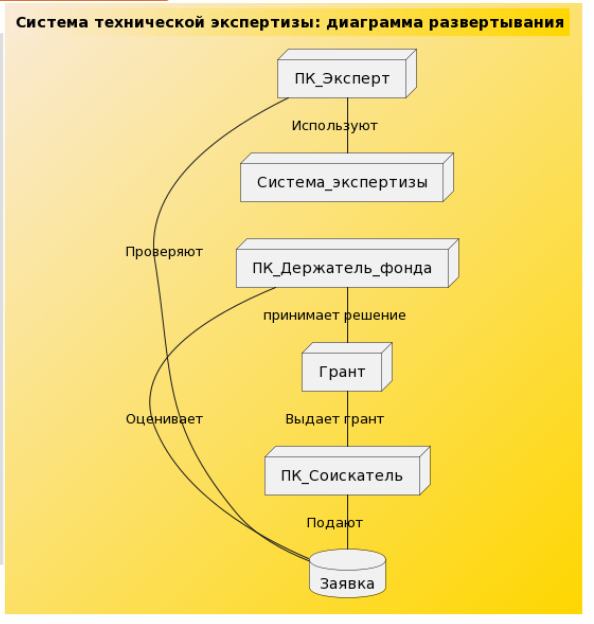

# Практика 0
```
@startuml
left to right direction
skinparam packageStyle rect

actor эксперт
actor соискатель_грантов
actor держатель_фонда

rectangle информационная_система_технической_экспертизы {
  
  соискатель_грантов--(подача заявки)
  соискатель_грантов--(выгодная презентация)

  (подача заявки) .> (независимая экспертиза)

  эксперт--(рассмотрение заявок)
  эксперт--(независимая экспертиза)
  
  (независимая экспертиза).> (выдача гранта)

  держатель_фонда--(оценка результата экспертизы)
  держатель_фонда--(выдача гранта)

}
@enduml

```


# Практика 1

```
@startuml
left to right direction
title Система технической экспертизы
actor Эксперт
actor Соискатель_грантов
actor держатель_фонда
rectangle Система {
держатель_фонда -- (организация мероприятия)
(организация мероприятия) ..>(подача заявки):<<include>>
(организация мероприятия) ..> (независимая экспертиза):<<include>>
(организация мероприятия) ..> (оценка результатов экспертизы):<<include>>

Соискатель_грантов -- (подача заявки)
(подача заявки) ..> (Выдача гранта):<<include>>
(независимая экспертиза) ..> (Выдача гранта):<<include>>
(оценка результатов экспертизы) ..> (Выдача гранта):<<include>>
Эксперт -- (независимая экспертиза)
}
@enduml

```

```

@startuml
class Эксперт{
+Паспортные данные
+ФИО
+Должность
Проверка()

}

class Соискатель_грантов{
+Паспортные данные
+ФИО соискателя
+Номер гранта
Регистрация Гранта()
}

class Грант{
+Номер гранта
+ФИО Представителя гранта
+Презентация Гранта
}

class Держатель_фонда{
+ФИО
+Должность
Оценка результата экспертизы()
Выдача гранта()
}

class СтатусГранта{
+Номер гранта
+Статус Гранта
+Отчет об экспертизе
}

class Выполнено{
+Грант проверен
}

Эксперт --> Грант:Проверяет
Соискатель_грантов --> Грант:Регистрация гранта
Держатель_фонда --> Грант:Выдает
Эксперт --> СтатусГранта:Изменяет статус
Держатель_фонда --> СтатусГранта:Оценивает результат экспертизы
СтатусГранта --> Выполнено
Грант --> Выполнено
Выполнено --> ВыдачаГранта

```


# Практика 2

```
@startuml
title Информационная система технической экспертизы: диаграмма последовательности
skinparam backgroundcolor AntiqueWhite/Gold
participant Соискатель
participant Заявка
participant Эксперт 
participant Держатель_фонда
participant Грант
activate Соискатель
Соискатель -> Заявка: подает заявку
activate Заявка
Заявка -> Эксперт : Выдает заявку
deactivate Соискатель
activate Эксперт 
Эксперт -> Заявка:Оценивает заявку
Заявка-> Держатель_фонда:Заявка одобрена
deactivate Заявка
activate Держатель_фонда
Держатель_фонда -> Грант:Принимает решение о выдаче грантов
deactivate Держатель_фонда
activate Грант
Грант-> Соискатель:Выдает грант
deactivate Эксперт 
activate Соискатель
@enduml 


```

```
@startuml
left to right direction
title Система технической экспертизы: диаграмма развертывания
skinparam backgroundcolor AntiqueWhite/Gold
database Заявка
node ПК_Эксперт
node ПК_Соискатель
node ПК_Держатель_фонда
node Грант
node Система_экспертизы

ПК_Эксперт - Заявка: Проверяют
ПК_Соискатель - Заявка: Подают
ПК_Эксперт - Система_экспертизы: Используют
ПК_Держатель_фонда - Заявка: Оценивает
ПК_Держатель_фонда - Грант: принимает решение
Грант - ПК_Соискатель: Выдает грант
@enduml

```

